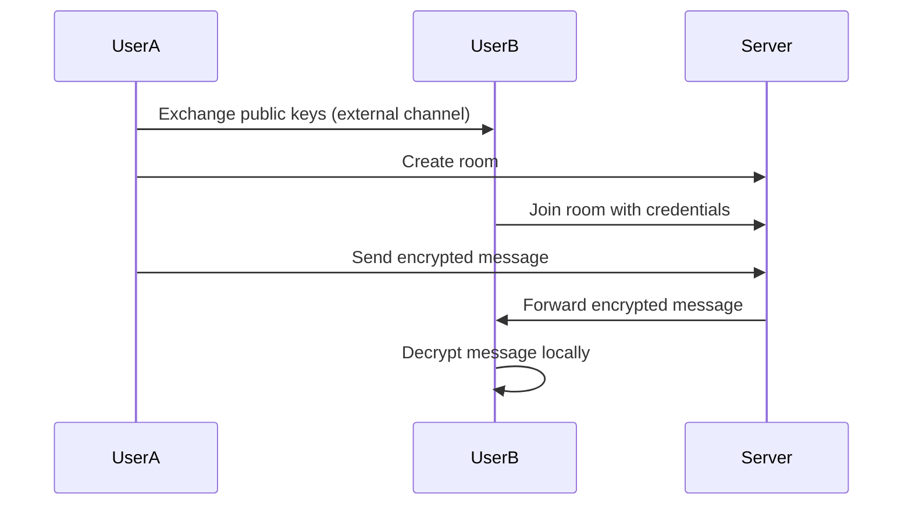

# Secure Encrypted Chat Application (*simple-chat*)

Simple-chat

A real-time encrypted chat application where users can create private rooms and exchange messages with end-to-end encryption. Messages are never stored on the server and remain confidential between participants.

*Currently room supports only 2 members*


## Key Features

- 🔒 End-to-end encryption using asynchronous cryptography
- 🚀 Real-time message exchange using WebSocket
- 📦 No message storage - messages exist only during session
- 🔑 Client-side key management
- 🌐 Cross-platform compatibility
- 🛠️ Room-based communication architecture

## Technology Stack

**Frontend:**
- React.js
- WebSocket Client
- Encryption Library (OpenPGP.js)
- Tailwind CSS
- Shadcn/ui components

**Backend:**
- Node.js
- Express.js
- WebSocket (Socket.io)
- TypeScript
- Sequelize
- Postgres

## Security Architecture



## Installation

 1. Clone repo 
```bash
    git clone https://github.com/iLoneCoder/simple_chat.git
    cd simple-chat
   ```

 2. Install backend packages and run
```bash
    cd backend
    pnpm install
    pnpm run dev
```
 3. Configure environment variables (create `.env` in backend directory) according to .env.example

 4. Install frontend packages and run
```bash
    cd frontend
    pnpm install
    pnpm run dev
```

